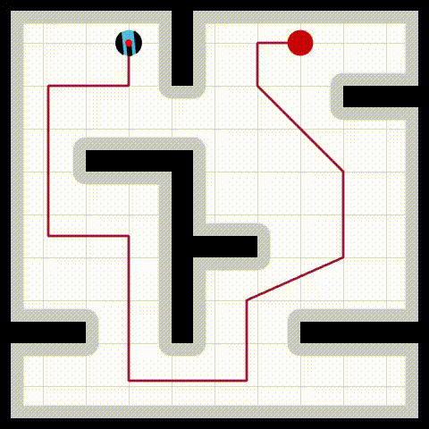

# Unicycle Motion Control, Prediction, and Navigation
 &nbsp;
\
This repository provides the MATLAB code used to prepare numerical simulations of the study "Adaptive Headway Motion Control and Motion Prediction for Safe Unicycle Motion Design".

 [İşleyen, Aykut, Nathan van de Wouw, and Ömür Arslan. "Adaptive Headway Motion Control and Motion Prediction for Safe Unicycle Motion Design." arXiv preprint arXiv:2209.12648 (2022).](https://arxiv.org/pdf/2304.02760.pdf)

---

## Table of Contents
- [Introduction](#introduction)
- [MATLAB Dependencies](#matlab-dependencies)
- [Usage](#usage)
- [Roadmap](#roadmap)
- [Authors](#authors)
- [License](#license)

---

### Introduction
As part of the ongoing research in safe unicycle robot navigation, this repository houses the MATLAB code that facilitates numerical simulations outlined in the paper "Adaptive Headway Motion Control and Motion Prediction for Safe Unicycle Motion Design." The provided code serves as a foundation for studying motion control strategies and navigation techniques for unicycles in cluttered environments. The research aims to enhance the capabilities of unicycle robots, leading to their successful integration into real-world applications, such as autonomous delivery systems, surveillance, and exploration missions.

We hope this repository and its code inspire your research and applications. Feel free to explore the provided simulations, experiment with various configurations, and adapt the code to suit your specific needs. For any questions, feedback, or collaboration opportunities, please reach out to us!

---

### MATLAB Dependencies

The code was developed using `MATLAB R2022a` and depends on several MATLAB toolboxes. The following toolboxes are required to run the simulations:

- Image Processing Toolbox
- Mapping Toolbox
- MATLAB Coder
- Navigation Toolbox
- Robotics System Toolbox
- ROS Toolbox

Note: Folders starting with the symbol "+" are the custom matlab tools developed for this repository and include the dependencies for the main demo applications.

---

### Usage
To run the simulations, follow these steps:

1. Download or clone this repository to your local machine.
2. Open MATLAB and navigate to the repository's root directory.
3. Run "startup.m" to add all the necessary files/subfiles to the MATLAB path.
4. Execute the simulation codes under the folder `demo`:
    - `demo_motion_prediction.m`: Demo for unicycle feedback motion predictions that bound the closed-loop unicycle motion trajectory under adaptive headway control towards a given goal position: circular motion prediction and triangular motion prediction.
    - `demo_motion_bound.m`: Demo for unicycle feedback motion bounds that bound the closed-loop unicycle motion trajectory under adaptive headway control towards a fixed given goal position: circular motion bound and triangular motion bound.
    - `demo_safe_path_follow_via_motion_prediction.m`: Demo for safe unicycle robot path following via feedback motion prediction and safety assessment.

 --- 

### Roadmap

Our ongoing efforts include exploring new unicycle control methods and motion design techniques to enhance the capabilities of autonomous systems. These studies revolve around various aspects of unicycle robot navigation, predictive control, and advanced motion planning strategies. For more information on these studies, please refer to the following links:

- [İşleyen, Aykut, Nathan van de Wouw, and Ömür Arslan. "From low to high order motion planners: Safe robot navigation using motion prediction and reference governor." IEEE Robotics and Automation Letters 7.4 (2022): 9715-9722.](https://ieeexplore.ieee.org/stamp/stamp.jsp?arnumber=9832477)
- [Arslan, Ömür, and Aykut İşleyen. "Vandermonde Trajectory Bounds for Linear Companion Systems." arXiv preprint arXiv:2302.10995 (2023).](https://arxiv.org/pdf/2302.10995.pdf)
- [İşleyen, Aykut, Nathan van de Wouw, and Ömür Arslan. "Feedback Motion Prediction for Safe Unicycle Robot Navigation." arXiv preprint arXiv:2209.12648 (2022).](https://arxiv.org/pdf/2209.12648.pdf)

---

### Authors
The code is authored by Aykut Isleyen and [Dr. Ömür Arslan](https://omurarslan.github.io/).

---

### License
This project is licensed under the MIT License. See the LICENSE file for details.

